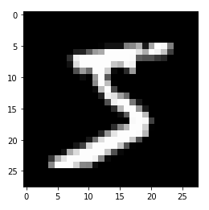
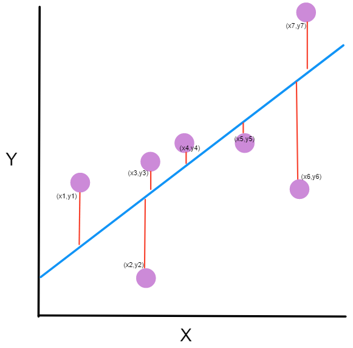
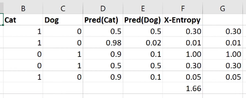

I’m working through the [“Practical Deep Learning for Coders”](https://course.fast.ai/) course by fast.ai, and blogging about my experience. Since the incredibly generous fast.ai community has already made detailed notes for each lesson (see the [Lesson 5 notes](https://github.com/hiromis/notes/blob/master/Lesson5.md#mnist-sgd-12359)), I’m just writing about the parts of the lecture and accompanying Jupyter notebooks that I needed stop and think through several times.

Starting with the notebook, we import matplotlib and the fast.ai library:%matplotlib inline  
from fastai.basics import \*

Then we need to get the ‘pickled’ MNIST dataset, so I [download it](http://deeplearning.net/data/mnist/mnist.pkl.gz) and try to figure out where I need to put it. Here’s the next line of code in the notebook:

```python
path = Config().data_path()/’mnist’
```

But I get the following error when I run it:

```txt
FileNotFoundError: [Errno 2] No such file or directory: '/home/jupyter/.fastai/data/mnist'
```

I check out the code in the notes, which is different from the notebook:

```python
path = Path('data/mnist')
```

It looks like we put the data in a new folder in the ‘data’ subdirectory? Okay, so I create a folder in the “data” directory, call it “mnist,” then upload mnist.pkl.gz into it. That works!

Then we flatten the images and see that this one, for instance, is the number 5:



The next bit that tripps me up slightly iss when Jeremy says of the images: “Currently they are numpy arrays. I need them to be tensors. So I can just map torch.tensor across all of them, and so now they’re tensors.” I realize I don’t know what the difference between a numpy array and a tensor is, so I look it up. It turns out there are many different definitions of tensors, some of which directly contradict one another.


Finally, I decide the definition in Ian Goodfellow’s _Deep Learning_ makes the most sense to me, and coming from that book must mean it’s the right one for these purposes, anyway. Goodfellow says: “In some cases we will need an array with more than two axes. In the general case, an array of numbers arranged on a regular grid with a variable number of axes is known as a tensor.” So this is in line with those who say a tensor is a multi-dimensional array, where a scalar is a 0-dimensional tensor, a vector is a 1-dimensional tensor, and a matrix is a 2-dimensional tensor. Works for me! I also read through [this tutorial](https://machinelearningmastery.com/introduction-to-tensors-for-machine-learning/) on how numpy handles tensor arithmetic.

Then I do fine for a bit, until we’re getting ready to “linearize” our model, when instead of doing this manually, as we did in previous lessons, Jeremy says: “So the only thing we want to add is we want to create an attribute in our class which contains a linear layer, an nn.Linear module. What is an nn.Linear module? It’s something which does x@a, but actually it doesn’t only do that; it actually is x@a + b. So in other words, we don’t have to add the column of ones. That’s all it does. If you want to play around, why don’t you try and create your own nn.Linear class? You could create something called MyLinear and it’ll take you (depending on your PyTorch background) an hour or two. We don’t want any of this to be magic, and you know all of the things necessary to create this now.”

So I stared at that for several minutes, coming up with exactly no idea of how to go about this. I looked at how it would be called in the next cell:

```python
class Mnist_Logistic(nn.Module):
    def __init__(self):
        super().__init__()
        self.lin = nn.Linear(784, 10, bias=True)

    def forward(self, xb):
        return self.lin(xb)
```

Okay, so we’re passing it the number of images (784), 10 (10 what?), and we’re setting bias=True, because we want to add a bias to `x@a`, hence `x@a + b.` I scroll down in the notes and remember Jeremy saying: “Our input is 784-dimensional and we need something that’s going to give us a probability of 10 numbers. After that happens we’ve got ten activations which we then want to add the bias to, so there we go.” So that’s where the 10 comes from.

But I have no idea how to proceed from there, so I turn to the fast.ai forums and find only [one thread](https://forums.fast.ai/t/lesson-5-implementing-diy-nn-linear/53941) on this question, with zero replies, so I wonder whether many people actually try to do this. In true fast.ai spirit, I decide to set this question aside and continue on, instead of getting bogged down in minutia.

The next bit I had to stop and think about was the choice of loss functions. In previous lessons, we’d used the mean-squared error function, or MSE. That works well when you make a prediction and can then measure “how far off” your observed result was from your prediction, as shown below.



[freecodecamp.org](https://www.freecodecamp.org/news/machine-learning-mean-squared-error-regression-line-c7dde9a26b93/)

But as Jeremy says, that loss function doesn’t make sense for a classification problem like this one, because we’re not considering the numeric value of the digit represented in an image: we’re considering the _image itself_. So it’s not sensible to think that 3 is closer to 4 than 0 is to 4 in an image recognition context, because if we think the digit we’re looking at is a 3, but it’s really a 4, that’s just as wrong as thinking it’s 0.

So he says we’ll use cross-entropy loss instead, which considers not only whether a prediction was correct or incorrect, but the confidence with which the prediction was made. In the example from the lesson shown below, we’re predicting whether an image is of a cat or a dog.



Screenshot from Lesson 5

The image shows the calculation in a spreadsheet, but here’s the Python version of the calculation:

```python
def CrossEntropy(Pred)Cat), Cat):    if Cat == 1:      return -log(Pred(Cat))    else:      return -log(1 - Pred(Cat))
```

In Jeremy’s words: “If it’s a cat, then take the log of cattiness and if it’s a dog (i.e., otherwise) take the log of one minus cattiness (in other words, the log of dogginess).” We’re negating the results, and I think that must be because the results will themselves be negative, but in words we refer to the value of the “loss,” and if the “loss” were negative, it would be like losing a negative value; i.e., adding, not losing. So it makes sense for the loss to be a non-negative value.

So we calculate the cross-entropy loss for each iteration, then add all of those values to find the cross-entropy loss for the model as a whole.

That’s it for Lesson 5! See you soon for Lesson 6.

See the code in the MNIST [notebook on GitHub](https://github.com/LauraLangdon/Lesson-5-MNIST).

* * *

Other posts on this topic:

Lesson 1: [Getting Started With fast.ai](https://towardsdatascience.com/getting-started-with-fast-ai-350914ee65d2)

Lesson 2: [Classifying Pregnancy Test Results](https://towardsdatascience.com/classifying-pregnancy-test-results-99adda4bca4c)

Lesson 2 (the sequel): [Can Deep Learning Perform Better than Pigeons?](https://towardsdatascience.com/can-deep-learning-perform-better-than-pigeons-d37ef1581a2f)

Lesson 3: [10,000 Ways that Won’t Work](https://towardsdatascience.com/10-000-ways-that-wont-work-311925525cf0)

Lesson 4: [Predicting a Waiter’s Tips](https://towardsdatascience.com/predicting-a-waiters-tips-1990342a0d02)

* * *

I’m a mathematics lecturer at CSU East Bay, and an aspiring data scientist. Connect with me on [LinkedIn](https://linkedin.com/in/laura-langdon/), or say hi on [Twitter](https://twitter.com/laura_e_langdon).
