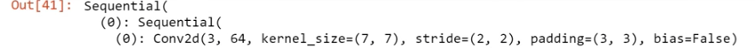
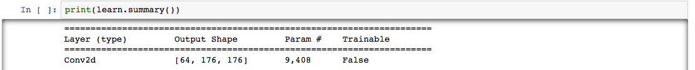

I’m working through the [“Practical Deep Learning for Coders”](https://course.fast.ai/) course by Jeremy Howard and Rachel Thomas of fast.ai, and blogging about my experience. Since the incredibly generous fast.ai community has already made detailed notes for each lesson (see the ones for Lesson 6 [here](https://github.com/hiromis/notes/blob/master/Lesson6.md)), I’m just writing about the parts of the lecture and accompanying Jupyter notebooks that I needed stop and think through several times.

The first topic I needed to review came up during the discussion of affine transformations with regard to data augmentation. What does “affine” mean again? Something to do with being linear. I consulted Google and found lots of explanations that were clear as mud, but [this one](https://math.stackexchange.com/questions/275310/what-is-the-difference-between-linear-and-affine-function) on Math Stack Exchange worked for me: a linear function just scales, but an affine function scales and \*shifts\*.

I spent most of the rest of my Lesson 6 time understanding convolutions. Jeremy says all the pictures in the docs are of cats because [Sylvain Gugger](https://twitter.com/GuggerSylvain) likes cats and he wrote most of the docs (though [Sylvain says](https://forums.fast.ai/t/lesson-6-in-class-discussion/31440/129?u=go_go_gadget) he doesn’t like cats, in fact, and just puts them in to lure people into reading the docs, which is quite funny).

So let’s explore convolutions, and maintain the feline theme with Grumpy Cat (RIP).

Jeremy uses Bret Victor’s [Image Kernel animation](http://setosa.io/ev/image-kernels/) to illustrate how convolution arithmetic works. Given a matrix whose elements represent pixels of an image, a convolution takes an element of that matrix, and uses a (usually square) matrix like the 3 x 3 one shown below to do an element-wise matrix multiplication on the values of the elements around the element/pixel pixel chosen, with that pixel at the center of the matrix. If the pixel is close to the edge of the image, we may need to “pad” the matrix, as shown in [this animation](https://github.com/vdumoulin/conv_arithmetic/blob/master/README.md) by Francesco Visin. Finally, we add all of the products to get one value (so in linear algebra terms, we’re just doing a dot product).

Using the Grumpy Cat image with the “sharpen” kernel shown below, we see that the kernel will strongly emphasize the pixel it’s “looking at” (the one in the center) by multiplying it by 5, while deemphasizing the pixels around it, by multiplying them by 0 or -1, increasing the contrast between them.

![Left: a 3x3 matrix containing the values [[0, -1, 0], [-1, 5, -1], [1, -1, 0]] Right: Grumpy Cat in greyscale and sharpened. Caption: the sharpen kernel emphasizes differences in adjacent pixel values. This makes the image look more vivid.](./02e2b1c9.png)

Similarly, using the “blur” kernel, we see that this kernel decreases the value of the pixel in question to 0.25, but decreases the value of the pixels around it even more, which decreases the overall contrast.

![Left: a 3x3 matrix containing the values [[0.0625, 0.125, 0.0625], [0.125, 0.25, 0.125], [0.0625, 0.125, 0.0625]]. Right: Grumpy Cat in greyscale and softened. Caption: the blur kernel de-emphasizes differences in adjacent pixel values.](./46e343b6.png)

Sometimes when learning something, it can feel like “Yes, all of this makes perfect sense, and I’ve totally got this,” and then you try to explain it and realize you actually understood next to nothing about what you just heard. Stopping to explain a concept you’ve just learned to someone else, even if that someone is imaginary (or a blog ;) ), is a highly efficient way to determine whether you really understand it!

This moment was one of those for me: we’re running a tensor through a series of convolutions, each reducing the height and width but increasing the number of output channels, and when we’re finished, we have the tensor illustrated below.

[https://www.youtube.com/watch?v=U7c-nYXrKD4&feature=youtu.be&t=5630](https://www.youtube.com/watch?v=U7c-nYXrKD4&feature=youtu.be&t=5630)

512 feels sort of normal, being a power of 2, but why do we stop at 11 in particular for the other two dimensions?

I almost didn’t write this up because to figure it out, I just watched the video and read the notes dozens of times, and didn’t feel like I had anything to add to them, in the end. But to understand it, I had to write it up for myself in a different order than it was shown in the video/notes, so here’s that write-up, in case it helps anyone else.

So let’s back up. We started with a tensor representing an image, and that tensor had 3 channels (red, blue, and green), a height of 352 pixels, and a width of 352 pixels. Here’s the shape of the tensor:

![Jupyter input cell with the value `t=data.valid_ds[0][0].data; t.shape`, followed by an output cell with the value `torch.Size([3, 352, 352])](./4a61c335.png)

We have many images, so many such tensors, but PyTorch expects us to use mini-batches of one image each, so [as Jeremy says](https://youtu.be/U7c-nYXrKD4?t=5538), we can index into the array with the special value of `None` , which creates a new unit axis, giving us a rank-4 tensor of shape `[1, 3, 352, 352]` . This is a mini-batch of 1 image, which has 3 channels, a height of 352 pixels, and a width of 352 pixels. One thing I had to continuously do a sanity check on was that the shape function returns the channels before the height and width, but when we consider the tensors as multi-dimensional matrices, we list the dimensions as height x width x number of channels. So in matrix terms, the tensor above is of dimensions 352 x 352 x 3 (remember the 1 isn’t a dimension of the matrix; it’s the size of the mini-batch).

Then we run the tensor through a series of activations, starting with a 2-dimensional convolution `Conv2d`, which uses a stride of size 2. That means that rather than “looking” at each element of the matrix, it’s “looking” at every other element, “jumping over” half of them. That’s what causes the height and width to be cut in half, and the number of output channels to double.

So when we run the tensor through the first convolutional layer, we take a matrix of dimensions 352 x 352 x 3 and run it through 64 convolutions (or kernels) with a stride of size 2, and we get back a matrix of dimensions (352 / 2) x (352 / 2) x 64; that is, it’s 176 x 176 x 64, or in PyTorch shape terms as shown below:

We then run the tensor through two more layers: `BatchNorm2d` and `ReLU`, which don’t change the shape, and then the pooling layer `MaxPool2d` , which does change the shape to 88 x 88 x 64. I found Jason Brownlee’s [A Gentle Introduction to Pooling Layers for Convolutional Neural Networks](https://machinelearningmastery.com/pooling-layers-for-convolutional-neural-networks/) very helpful in understanding how pooling layers work.

We keep going through more of those layers several times, and every now and then we divide the height and width each by 2, and double the number of kernels. So at one point we have 44 x 44 x 256, then 22 x 22 x 512, then, finally, the 11 x 11 x 512 matrix we were wondering about.

So I think we stop at 11 for the height and width simply because 11 is an odd number! If we were to divide 11 by 2, we’d get 5.5, which isn’t really a suitable dimension for a matrix. It feels like the number of hours I spent chasing that tensor were far out of proportion to the simplicity of the answer. Still, I definitely understand the dimensional gymnastics far better than I did before, so I guess that’s something!

Check out the full code in the [pets notebook](https://github.com/LauraLangdon/pets) on GitHub, and I’ll see you next week for Lesson 7!
