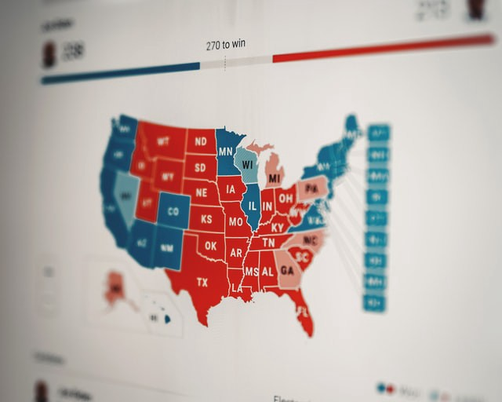

Hi! I’m Laura, and I’m learning machine learning. I’m also a mathematics lecturer at Cal State East Bay, and have been fortunate to be able to work with my mentor [Prateek Jain](https://www.linkedin.com/in/prateekj/) as a Data Science Fellow at [SharpestMinds](https://www.sharpestminds.com/). This project was selected as a way for me to practice writing a machine learning algorithm from scratch (no scikit-learn allowed!) and to therefore deeply learn and understand the k-nearest neighbors algorithm, or k-NN.

## The k-NN algorithm

If you’re not already familiar with k-NN, it’s a nice ML algorithm to make your first deep dive with, because it’s relatively intuitive. Zip codes are frequently useful proxies for individuals because people who live in the same neighborhood often have similar economic backgrounds and educational attainment, and are therefore also likely to share values and politics (not a guarantee, though!). So if you wanted to predict whether a particular piece of legislation would pass in an area, you might poll some of the area’s constituents and assume most of those constituents’ neighbors will feel similarly about your bill as do the majority of those you polled. In other words, if you were asked how a particular person in that district might vote, you wouldn’t know for sure how they’d vote, but you’d look at how their polled neighbors said they were going to vote, and assume your person would vote the same as the most common answer given in the poll.



Photo by [Clay Banks](https://unsplash.com/@claybanks?utm_source=unsplash&utm_medium=referral&utm_content=creditCopyText) on [Unsplash](https://unsplash.com/s/photos/political-map?utm_source=unsplash&utm_medium=referral&utm_content=creditCopyText)

k-NN works very similarly. Given a set of labeled data and an unlabeled data point x , we’ll look at some number k of x's neighbors, and assign to x the most common label among those k neighbors. Let’s get a visual: in the image below, we have an unlabeled dot and 15 neighbors of its neighbors. Of those 15 neighbors, 9 have a magenta “A” label and 6 have a blue “B” label.


Illustration by me!

Since more of the unlabeled dot’s neighbors have an “A” label than a “B” label, we should label our dot with an “A”. And that’s k-NN!

## What k-NN is not

Notice, though, what k-NN is \*not\*: we didn’t give our dot the label of its \*closest\* neighbors! Our dot is closest to the 6 “B” dots, but we didn’t call it “B”. That distinction tripped me up while I was writing my code, maybe because of the word “nearest” in the name of the algorithm? Anyway, I got all the way through writing a function that looked at a data point’s neighbors and selected the ones that were within some distance k of that data point, which is actually a different algorithm entirely: the [Radius Neighbors Classifier](https://scikit-learn.org/stable/modules/generated/sklearn.neighbors.RadiusNeighborsClassifier.html#sklearn.neighbors.RadiusNeighborsClassifier). I should do that again and compare the results to k-NN! In another blog post, perhaps.

Something else to know about what k-NN is not is that k-NN is not a good choice of algorithm for a problem that lives in a higher-dimensional space (spoiler: this is going to end up being the punchline of this post!). Since k-NN assumes that data points “near” each other are likely to be similar, and since in a high-dimensional space the data can be spread really far apart, that notion of “nearness” becomes meaningless (for a longer explanation of this, check out this [video](https://youtu.be/DyxQUHz4jWg)!). Consider the islands of Australia and New Zealand: they’re each other’s closest neighbors, but they’re still thousands of kilometers apart, so they have very different climates, terrain, and ecosystems.


Left: photo of an Australian desert by [Greg Spearritt](https://unsplash.com/@mcoot20?utm_source=unsplash&utm_medium=referral&utm_content=creditCopyText) on [Unsplash](https://unsplash.com/s/photos/australian-desert?utm_source=unsplash&utm_medium=referral&utm_content=creditCopyText). Right: photo of a New Zealand forest by [Tobias Tullius](https://unsplash.com/@tobiastu?utm_source=unsplash&utm_medium=referral&utm_content=creditCopyText) on [Unsplash](https://unsplash.com/s/photos/new-zealand-forest?utm_source=unsplash&utm_medium=referral&utm_content=creditCopyText).

## The code

Okay, so now that we know what k-NN is and what it is not, let’s have a look at [the way I coded it up](https://github.com/LauraLangdon/knn)! Please, please note that this was explicitly an exercise for a very beginner, and it will not be as elegant or clever as the way a more experienced practitioner would do it. My instructions were to code everything from scratch, so I didn’t use Pandas to read in my data and I didn’t look at how anyone else had done it. I don’t recommend that you use my code, and I don’t need comments or emails about what you don’t like about it, because my mission was to learn this algorithm and to spend more time in my [IDE](https://www.jetbrains.com/pycharm/) instead of a Jupyter notebook, and I succeeded in those aims. :)

My mentor suggested I could use Twitter data for this project, and I needed to be able to download a large number of tweets by a single author. Ideally this author would have quite a distinct writing style, to make it easier for the algorithm to identify an unlabeled tweet as belonging to that author or not. This was the summer of 2020 and the presidential election in the states was gearing up, so my mentor thought it would be interesting to use Donald Trump as the test case (Lots of tweets? Yep. Distinctive writing style? Yep). Note: this project is definitely not an endorsement of The Former Guy, and I actually almost started over with a new batch of tweets from a different author because I don’t want to grant him any more of my headspace, but I ended up deciding against scope creep and to just get this project finished.

I found a [site with all of TFG’s tweets](https://dataverse.harvard.edu/dataset.xhtml?persistentId=doi:10.7910/DVN/KJEBIL) aggregated into a txt file, and a [Kaggle dataset](https://www.kaggle.com/rtatman/the-umass-global-english-on-twitter-dataset) with over 10,000 tweets by different people in a tsv file to serve as a comparison for the algorithm. Then I needed to write a function that would read the data in these files into arrays, so I could work with them.

```python
def csv_list_maker(data_file, delimiter=',') -> list:
    """
    Turn data in csv form into list form

    :param data_file: file containing the data
    :param delimiter: character delimiting the data

    :return: data_list: data in list form
    """

    data_reader = csv.reader(data_file, delimiter=delimiter)
    data_list = list(data_reader)

    return data_list
```

But my data didn’t come in csv files; it was in a txt file and a tsv file! So I needed another function to convert these other file types into csv. I decided to make the function a bit more robust by including cases for several different file types:

```python
def read_file(file_name: str, key_name='') -> list:
    """
    Open and read csv.gz, .tsv, .csv, or JSON file; return as list

    :param file_name: Name of file
    :param key_name: Name of JSON key (optional)

    :return: data_list: Data in list form
    """

    # Determine whether file is of type csv, gz, tsv, csv, or JSON
    if file_name[-6:] == 'csv.gz':
        data_file = gzip.open(file_name, mode='rt')
        data_list = csv_list_maker(data_file)

    elif file_name[-3:] == 'tsv':
        data_file = open(file_name, newline="")
        data_list = csv_list_maker(data_file, delimiter="\t")

    elif file_name[-3] == 'csv':
        data_file = open(file_name)
        data_list = csv_list_maker(data_file)

    elif file_name[-4:] == 'json':
        with open(file_name, 'r') as read_file:
            data_file = json.load(read_file)
            data_list = []
            for item in range(len(data_file)):
                data_list.append(data_file[item][key_name])
    else:
        print('Unusable file type. Please submit file of type csv.gz, .csv, .tsv, or JSON')
        return []

    return data_list
```

Now I had a set of arrays with tweets from TFG and a set of arrays of tweets by other people, but if I compared them as they were I’d waste a lot of time comparing ubiquitous words like “the” or “and”, which are called “stop words” because they don’t meaningfully contribute to analysis. So I found a list of stop words and wrote a function to remove them from my arrays, and also to remove numbers and punctuation, since they wouldn’t help the analysis either. I also converted all characters to lowercase. Finally, I would need to make a “[bag of words](https://en.wikipedia.org/wiki/Bag-of-words_model)” or corpus to contain a list of all the words used in all of the tweets, and it would make sense to do that at the same time as I was cleaning the text, so I would only keep of a copy of each “cleaned” word.

```python
def clean_text(corpus, input_string: str) -> list:
    """
    Clean text data and add to corpus

    :param corpus: list of all words in the data
    :param input_string: string of words to be added to the corpus

    :return: output_string_as_list: cleaned list of words from input string
    """
    input_string = re.split(r'\W+', input_string)
    output_string_as_list = []
    for word in input_string:
        if word in stop_words_list:
            continue
        for char in word:
            if char in string.punctuation or char.isnumeric() or char == ' ':
                word = word.replace(char, '')
        if word == '':
            continue
        if word.lower() not in corpus:
            corpus.append(word.lower())
        output_string_as_list.append(word.lower())

    return output_string_as_list
```

Next I needed to vectorize my data so I’d be able to use NumPy functions later. To do this, I initialized a NumPy array with the same number of rows as I had tweets, with each row being as long as the number of words in the corpus + 2. I added the two extra columns so that the last column would keep track of whether the twee was written by TFG or not (1 for TFG, 0 for someone else), and the second-to-last character would store the index of the tweet so I could refer to it later during interpretation. For each tweet, my function would look at each word in the corpus and enter a ‘1’ in the column referring to that word if it appeared in the tweet, or a ‘0’ if that word wasn’t represented in that tweet. That meant these were \*very\* sparse arrays (mostly zeroes) — ooh, foreshadowing!

```python
def individual_tweet_vectorizer(corpus, tweet, index=0, author=''):
    """
    Formats a single tweet as a vector

    :param corpus: list of all words in tweets
    :param tweet: tweet to be vectorized
    :param index: index of tweet in main list of tweets
    :param author: Trump or general

    :return: Single tweet in vector form
    """
    individual_tweet_vector = np.zeros((1, len(corpus) + 2), dtype=int)
    for word in range(len(corpus)):
        if corpus[word] in tweet:
            individual_tweet_vector[0][word] = 1
    if author != '':  # If author is specified, set the last value of the tweet vector to 1
        individual_tweet_vector[0][-1] = 1
    individual_tweet_vector[0][-2] = index  # Keep track of index of tweet for interpretation
    return individual_tweet_vector
```

Then I needed to randomize the order of the vectors in my NumPy array so I could make training and test sets.

```python
def randomize_vectors(tweet_vectors):
    """

    :param tweet_vectors:

    :return: randomized_tweet_vectors: a Numpy array of tweet vectors that have
                 been randomly shuffled
    """
    #Initialize randomized tweet vectors
    randomized_tweet_vectors = np.zeros((tweet_vectors.shape[0], tweet_vectors.shape[1]), dtype=int)
    for x in range(tweet_vectors.shape[0]):
        for y in range(tweet_vectors.shape[1]):
            randomized_tweet_vectors[x][y] = tweet_vectors[x][y]
    np.random.shuffle(randomized_tweet_vectors)

    return randomized_tweet_vectors
```

I split the data so that 80% went into the training set and 20% into the test set.

```python
def split_train_test(tweet_vectors, randomized_tweet_vectors) -> tuple:
    """
    Split into train and test sets

    :param tweet_vectors: tweets in vector form

    :return: train_set, test_set tuple of train set and test set
    """
    x_train_dim = math.floor(0.8 * tweet_vectors.shape[0])  # Use 80% of data for train set
    x_test_dim = math.ceil(0.2 * tweet_vectors.shape[0])  # Use 20% of data for test set
    y_dim = tweet_vectors.shape[1]

    train_set = np.zeros((x_train_dim, y_dim), dtype=int)
    test_set = np.zeros((x_test_dim, y_dim), dtype=int)

    for x in range(x_train_dim):
        for y in range(y_dim):
            train_set[x][y] = randomized_tweet_vectors[x][y]
    for x in range(x_test_dim):
        for y in range(y_dim):
            test_set[x][y] = randomized_tweet_vectors[x + x_train_dim][y]

    return train_set, test_set
```

Getting there! Now I needed a way to compare how similar two tweets were to one another, which I would do by taking the absolute value of the difference between their vectors (absolute value because 1–0 is the same as 0–1 for this purpose, since both mean there’s a word that appears in one tweet but not the other). Each difference in words would add 1 to the “distance” between two tweets.

```python
def get_distance(tweet1_vector, tweet2_vector) -> int:
    """
    Implement Minkowski distance metric

    :param tweet1_vector: vector of first tweet
    :param tweet2_vector: vector of second tweet

    :return: Minkowski distance between tweets
    """
    distance = 0
    for x in range(tweet1_vector.shape[0] - 2):
        distance = distance + abs(tweet1_vector[x] - tweet2_vector[x])

    return distance
```

Now it was time to find the k-nearest neighbors! I needed to write a function that would take in a tweet vector and the number `k` , and compare all the other tweets to find a list of the `k` most similar to the tweet in question and return it.

```python
def knn(tweet_vector, train_set, k) -> list:
    """
    Find k nearest neighbors of a given tweet

    :param tweet_vector: vector of tweet whose neighbors we seek
    :param train_set: training set
    :param k: desired number of nearest neighbors

    :return: list of indices in main tweet list of k nearest neighbors, and distances of those
            neighbors to given tweet
    """
    knn_indices_and_distances = []
    distance = 0

    for x in range(len(train_set)):
        distance = get_distance(tweet_vector[0], train_set[x])
        knn_indices_and_distances.append([train_set[x][-2], distance])

    #  Sort by distance (smallest to largest)
    knn_indices_and_distances.sort(key=lambda x: x[1])

    return knn_indices_and_distances[:k]
```

Finally, I needed a function that would determine the most common label of the `k` tweets in the list returned by the previous function, which is where the 1 or 0 I’d added to the end of each tweet to indicate the author would come in handy.

```python
def majority_vote(tweet_vector, train_set, k) -> str:
    """
    Count how many of the k-NN tweets were written by Trump or not-Trump,
    and return whichever is larger

    :param tweet_vector: vector of given tweet
    :param train_set: training set
    :param k: desired number of nearest neighbors

    :return: Whether tweet was authored by Trump, not Trump, or draw
    """
   #  If k is even, subtract 1 so there can't be a draw
        if k % 2 == 0:
        k = k - 1
    knn_indices_and_distances = knn(tweet_vector, train_set, k)

    trump_votes = 0
    general_votes = 0
    for x in range(len(knn_indices_and_distances)):
        if train_set[x][-1] == 1:
            trump_votes += 1
            # print('trump vote')
            # print(trump_votes)
        else:
            general_votes += 1
            # print('general vote')
            # print(general_votes)

    if trump_votes > general_votes:
        return 'Trump'
    else:
        return 'Not Trump'
```

So yay, we did it! It turns out, though, that my program classifies every tweet I throw at as having been written by TFG, even when I know for sure it wasn’t.


The part where it doesn't work, and that's fine

I realized the sparseness of the tweet vectors meant that — kind of like Australia and New Zealand — two tweets being each other’s closest neighbors didn’t mean the tweets were actually very similar to one another at all. But that was okay! The purpose of this project was to get my hands dirty writing kNN from scratch and learning to process data without Pandas. (I also learned how to [pickle](https://www.geeksforgeeks.org/understanding-python-pickling-example/) my data once I’d processed it once, how and why to use [type casting](https://www.geeksforgeeks.org/understanding-python-pickling-example/) in my functions, and how to use [Sphinx](https://www.sphinx-doc.org/en/master/) to create [documentation for my project](http://lauralangdon.io/knn/) — though it’s not quite working properly yet. Still learning!). So this project served its purpose, even if the accuracy rate ended up being terrible.

I hope you enjoyed this stop on my learning journey!
