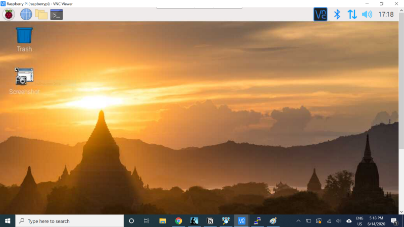
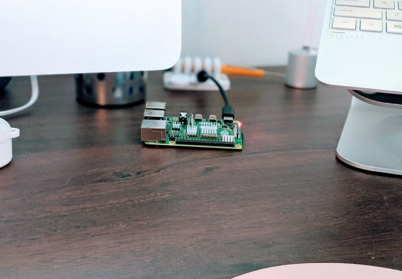

I’m about to build a computer vision project on a [Raspberry Pi 4](https://www.raspberrypi.org/products/raspberry-pi-4-model-b/), and it’s my first time using a Pi. I found the [setup instructions](https://projects.raspberrypi.org/en/projects/raspberry-pi-getting-started) on raspberrypi.org to be excellent (much easier than finding the SD card and HDMI adapter my husband had hidden put away!), though the card that came in the box was bemusing.

> Interpreting a card that came with my [@Raspberry\_Pi](https://twitter.com/Raspberry_Pi?ref_src=twsrc%5Etfw): reading is correct behavior, as is giving your Pi a friendly squeeze. Allowing your Pi to become hot while riding a flying carpet is incorrect behavior. Do not poke your Pi, as this will cause it to emit lightning. [pic.twitter.com/KLvTr7CESz](https://t.co/KLvTr7CESz)
> 
> — Laura Langdon moved to Mastodon (@laura\_e\_langdon) [June 12, 2020](https://twitter.com/laura_e_langdon/status/1271501163771293697?ref_src=twsrc%5Etfw)

Pretty much the second I finished setting it up, I was totally over having an extra monitor, keyboard, and mouse cluttering up my space. So I Googled to see if I could use my Windows laptop as a monitor for the Pi, and found [these instructions](https://maker.pro/raspberry-pi/projects/how-to-connect-a-raspberry-pi-to-a-laptop-display) on using SSH to log in to my Pi from my laptop. Result! But those instructions assumed I would be setting up the Pi from scratch, and wanted me to enable SSH by adding a file to the OS installer. I was already done with the OS installation, so I searched again to see if I could enable SSH post-installation.

The internet came through for me, and I used [these instructions](https://phoenixnap.com/kb/enable-ssh-raspberry-pi) to enable SSH on the Pi. Then I went back to the first set of instructions, starting at Step 4: Finding Raspberry Pi’s IP address. This involved installing [PuTTY](https://www.putty.org/), an SSH client, and [VNC Viewer](https://www.realvnc.com/en/connect/download/viewer/), which allows the user to view a desktop remotely.

All of that went smoothly, and it worked! My laptop displayed the Pi screen, just as the monitor connected to the Pi did, and I could use the laptop’s trackpad and keyboard to interact with the Pi.

Until I unplugged the Pi. When I plugged it in again, PuTTY gave a “Network error: Connection timed out” error when I tried to connect to the Pi through my laptop.

I went back to the [original instructions](https://maker.pro/raspberry-pi/projects/how-to-connect-a-raspberry-pi-to-a-laptop-display), and decided that the Step 3 I thought I’d worked around — Add Additional File to Enable SSH and Connect to Wifi on Boot — was probably better not skipped. I knew I’d enabled SSH, but I hadn’t considered that the Pi might not connect to Wifi automatically. So I popped the Pi’s SD card back into my laptop to add the files described in the article: “wpa\_supplicant.conf” and a blank file named “SSH.”

I didn’t know what my “country code” was in this context, but a Google search yielded [this article](https://www.raspberrypi-spy.co.uk/2017/04/manually-setting-up-pi-wifi-using-wpa_supplicant-conf/) on setting up Wifi manually on the Pi, and it said the United States country code was “US.” But it also said it was important to make sure to use the Unix line breaks, and it suggested using Notepad++ to do that formatting. So I installed Notepad++, created the two files according to the instructions of the two articles combined, saved these alongside the installer files, then put the SD card back in the Pi. I went through the setup process again from Step 4, crossing my fingers.

It worked! Now I could display the Pi’s screen in the VNC window on my laptop, with no need for the extra peripherals.

But I mainly use a Mac these days, and use the laptop as sort of a secondary display, or to run the odd program that’s better on Windows than Mac OS. I’m still stingy about allocating space for peripherals, though, and I put the laptop [on a stand](https://www.raindesigninc.com/mstand.html) that keeps it at better viewing angle, but makes using the keyboard and trackpad pretty annoying.

So I use [Synergy](https://symless.com/synergy), which allows me to use one keyboard and mouse to interact with both the Mac and the Windows laptop (and now also the Pi!). I have it set to start when I boot both machines, and it works seamlessly. To move its attention from one machine to the other, I just move my cursor to the right edge of my Mac, and it appears on the left edge of the laptop. The keyboard talks to whichever machine the cursor is on, and even the clipboard persists across both devices, so I can copy on one device and paste on the other.

Here they are all together:

Can you spot the Pi? Look closer:

I’ll have to move the Pi sometimes when I’m gathering image data for my computer vision project, but I’ll still only need one keyboard and mouse!

Connect with me on [LinkedIn](https://linkedin.com/in/laura-langdon/), or say hi on [Twitter](https://twitter.com/laura_e_langdon)! You can also find me at [lauralangdon.io](https://lauralangdon.iol).
